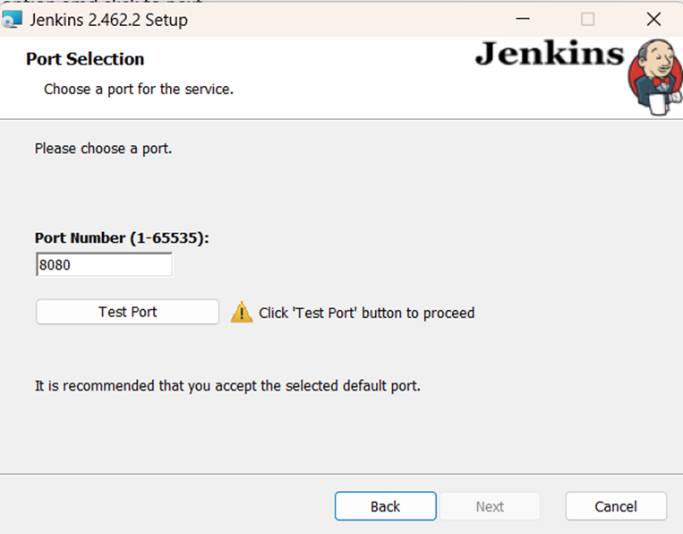
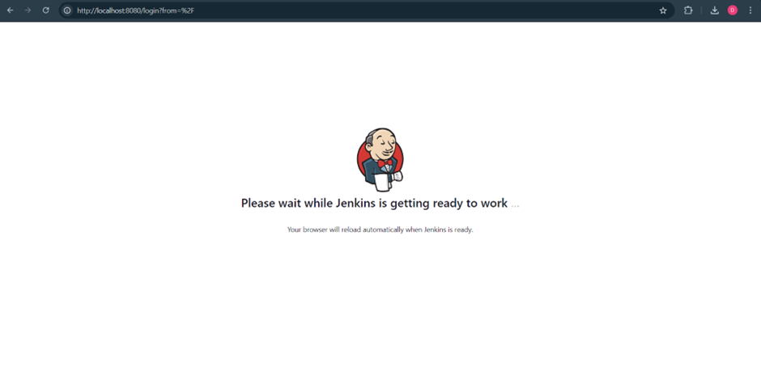
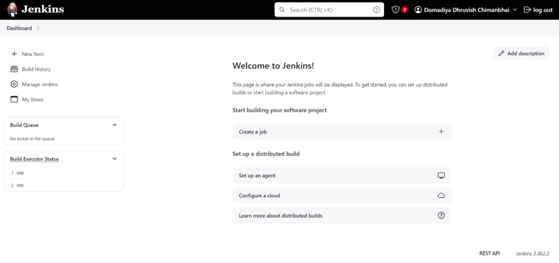

# Jenkins

## What is Jenkins?

Jenkins is an open source automation server written in Java. Jenkins helps to automate the non-human part of the software development process, with continuous integration and facilitating technical aspects of continuous delivery.

## What is Continuous Integration?

Continuous Integration is a development practice that requires developers to integrate code into a shared repository several times a day. Each check-in is then verified by an automated build, allowing teams to detect problems early.

## What is Continuous Delivery?

Continuous Delivery is a software development practice where code changes are automatically built, tested, and prepared for a release to production. It expands upon continuous integration by deploying all code changes to a testing environment and/or a production environment after the build stage.

## What is Continuous Deployment?

Continuous Deployment is a software release process that uses automated testing to validate if changes are correct and stable for immediate autonomous deployment to a production environment.

## What is Jenkins Pipeline?

Jenkins Pipeline (or simply "Pipeline") is a suite of plugins which supports implementing and integrating continuous delivery pipelines into Jenkins.

## What is Jenkinsfile?

Jenkinsfile is a text file that stores the pipeline as code. Jenkinsfile is written in Groovy and it allows defining various stages, steps, environment, and other information in the form of code.

## What is Jenkins Agent?

Jenkins Agent is a machine that executes the build. Jenkins Agent can be a master or a slave. Jenkins master distributes the build to agents and then agents execute the build and send the results back to the Jenkins master.

## What is Jenkins Master?

Jenkins Master is the main server where the builds are run. Jenkins Master distributes the build to agents and then agents execute the build and send the results back to the Jenkins master.

## What is Jenkins Slave?

Jenkins Slave is a machine that is used to offload the build from Jenkins Master. Jenkins Slave is also known as Jenkins Agent.

## What is Jenkins Node?

Jenkins Node is a machine that is part of the Jenkins environment and capable of executing a build.

## What is Jenkins Job?

Jenkins Job is the task defined in Jenkins to execute the build process. Jenkins Job can be created using the Jenkins UI or by using the Jenkinsfile.

## What is Jenkins Plugin?

Jenkins Plugin is a Java archive file (JAR) that is used to extend the functionality of Jenkins. Jenkins Plugin can be installed in Jenkins to add new features.

## What is Jenkins CLI?

Jenkins CLI is a command-line interface tool that allows you to interact with Jenkins using text commands.

## What is Jenkins Configuration as Code?

Jenkins Configuration as Code (JCasC) is a Jenkins plugin that allows you to define and configure Jenkins as code. With JCasC, you can define the Jenkins configuration in a YAML or Groovy file and then use that file to configure Jenkins.

# Jenkins Installation on Windows

## Step 1: Download Java

Make sure you have Java 11, 17, or 21 installed on your system.

## Step 2: Download Jenkins

1. Visit the [Jenkins official website](https://www.jenkins.io/).

   

2. Click on the **Download** button.

   

3. You will see options for different platforms.

   

4. Click on **Windows** to start the download.

   

## Step 3: Install Jenkins

1. After the download is complete, click on the Jenkins installer file to open it.

   

2. Follow the prompts and click **Next** to proceed.

   

3. You can change the folder path if needed, or leave it as default.

   

4. Select the first option and click **Next**.

   

5. Test the port and click **Next**.

   

6. Select the JDK folder path and click **Next**.

   

7. Click **Next** again to continue.

   

8. Click **Install** to start the installation.

   

## Step 4: Complete Installation

1. After the installation is complete, click **Finish** to exit the installer.

   

2. Open a web browser and navigate to `localhost:8080` to access Jenkins.

   

3. Go to the path `C:\ProgramData\Jenkins\.jenkins\secrets\initialAdminPassword`.

4. Open the file in Notepad, copy the password, and paste it into the Jenkins login screen, then click **Continue**.

   

## Step 5: Install Plugins

1. Click **Install Plugins**. Jenkins will automatically install all necessary plugins.

   

2. After the plugin installation is complete, you can either enter your details or skip and start using Jenkins.

   

   

   
